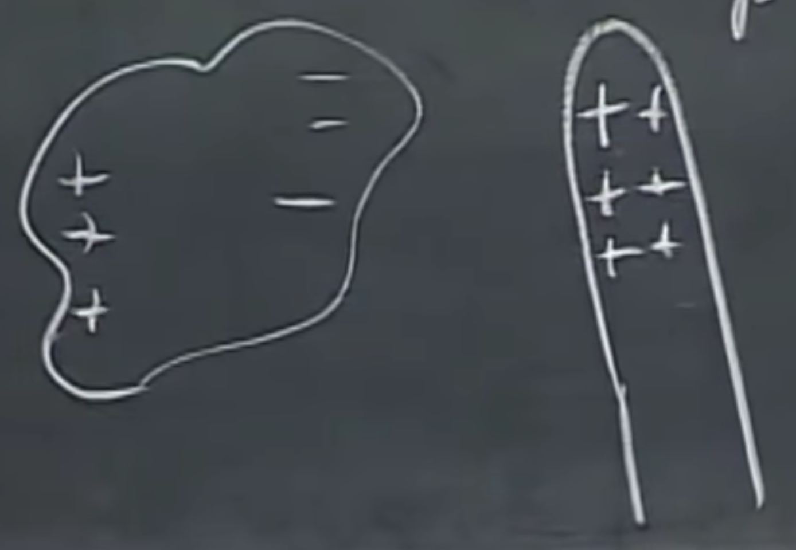
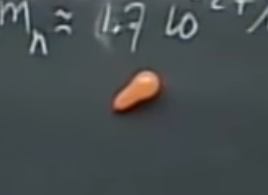
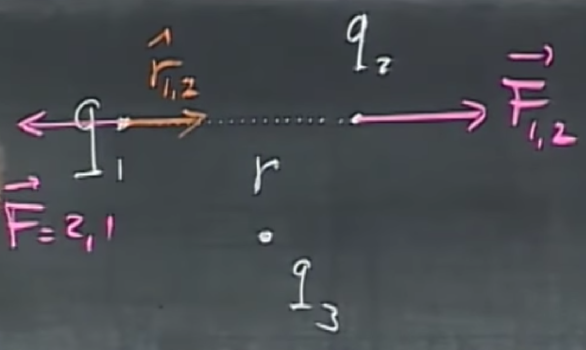

# Electricity basics

This is going to be a glorious journey, where you will get to know about elecricity and magnetism. But what is *even better*, you'll get to know about Time Machine Guy, The Magic Switcheroo, Darth Maul's lightsaber, charged trashcans, and more.

I recommend that you check out the [**Cheat Sheet**](X-Cheat_Sheet) and read it up to the current lecture you are at — do it after every lecture, you'll be thankful for having rock solid foundations when things get a little more involved. Unless you are Time Machine Guy, of course, then do not do it at all, but more on that later.

## What is this all needed for?
Electricity is everywhere. It is needed for light to exist, and also, clocks, microphones, radio, computers. Light is an electromagnetic wave. The colors of the blue sky are there because of electricity. Cars, planes. Horses need electricity to move, because muscle contractions require it.

If you are getting nervous by how many integrals you are about to see, note that your nerve system also works through electricity. The integrals are not though…they just are. Atoms, molecules, all chemical reactions exist because of electricity. You could not see without electricity, your heart would not beat without electricity, you could not even think without electricity.

### Conductors
There is only a small fraction of electrons that are not bound to atoms, and these electrons are freely moving around. Conductors may remain charged for longer periods of time. If we touch an aluminum object, the charges leave it as they flow through us. This is not the case with non-conductors, where most of the electrons are bound to atoms.

### Induction
How do electrons get into motion? For instance, when polarization happens, i.e., the charges move apart in different directions. This happens if you close in on an object that is positively charged to a different object, and the - (minus) charges are running towards it, while the + charges run away. This is induction. 

	Note: glass is not a conductor.

 

### Induction via rubbing
When rubbing a rubber balloon against our shirt, friction cases electricity, so it may stick to our hand afterward. Since rubber is not a conductor, and neither is our hand, induction happens and they will stick together. Small balloons stick easier, as you see below here. This one is shaped like a pear. Yum.

 

You may hear a cracking noise when combing your hair in a dry weather because the comb gets charged.

You may get charged by walking on a rug and then get a shock by touching a doorknob. Same may happen when you feel a shock when touching a person.

If you want to conduct an illegal experiment, you can beat someone up with cat fur. If your subject sits on a glass stool (non-conducting material), and is not sweating too much (i.e., it is dry), and you approach each other, there is going to be a huge shock. A neon discharge tube can help collecting the charges and lights up if you have a few thousand volts - this will be showcased in an experiment soon-ish.

# Coulomb's law

 

Given two electrically charged particles with charges $q_1$, $q_2$ that are $r$ distance apart, and $\hat{r}_{1,2}$, a unit vector pointing from $q_1$ to $q_2$, the force on point 2 due to 1 is

$$\vec{F}_{1,2} = k\frac{q_1 q_2}{r^2}\hat{r}_{1,2}.$$

The first variable, $k=9\cdot 10^9=\frac{1}{4\pi\epsilon_0}$, is Coulomb’s constant. This equation is sign sensitive, i.e., if $q_1$ and $q_2$ are positive or they are both negative, the force will be in direction $\hat{r}_{1,2}$. If one is positive, the other is negative, it negates the direction of the force. One unit of charge is named after the discoverer of this law, and is hence referred to as 1 Coulomb. It is quite reminiscent to how gravity works, in terms of magnitude, however, gravity is not sign sensitive.

We usually work with micro-Coulombs, or even less than that. The charge of one proton (or electron), i.e., $q_{p^+}=q_{e^-} \approx 1.6\cdot10^{-19}C$.

So, how powerful are electric forces compared to gravitational forces? I would say *much more* powerful, but that wouldn't cut it. Calculating these forces acting between two protons, $\frac{F_{el}}{F_{gr}}=10^{36}$, which means 36 orders of magnitude smaller. Whoa. Note that gravitation is not that strong, we can easily counteract the pulling of an enormous rock called the Earth with our tiny little muscles by moving around. Also note that this is an incredibly large force pushing the two protons apart. So what holds the nucleus together? Nuclear forces, which have to be even greater.

## Electroscope
To proceed from here, we somehow have to *measure* electricity. So how do we do that?
The electroscope is an instrument that typically contains an aluminum foil and is therefore a conductor, i.e., if you touch it with a charged object, it gets positively charged. As this happens, these aluminum tinsels (tails) will all be positive, and “open up” as they start repelling each other. It is such a simple an ingenious instrument, you can even DIY yourself at home — [**here**](https://www.google.com/search?client=firefox-b-d&q=diy+electroscope) is a general link for your convenience. Read carefully and try not to blow up the house, although if you do, rebuilding it might still come out cheaper than your tuition at MIT. What is even better, even though we, humans are not good conductors, but you can also *become* a living electroscope by touching something positively charged, and having an electroscope in the other hand - it will open up. Your hair is also an electroscope and will stand up. That is even better than DIY. How should we call it? Be It Yourself (BIY)? See below.

 