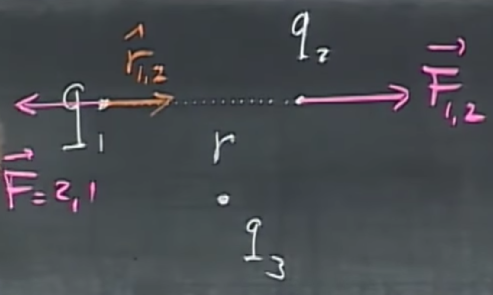
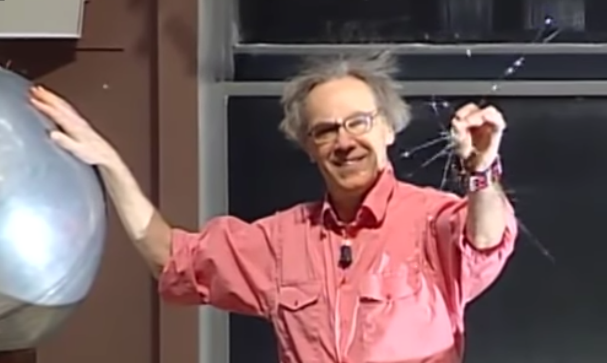

# Electricity basics

## What is it needed for?
Electricity is needed for lights. Clocks, microphones, radio, computers. Light is an electromagnetic wave. The colors of the blue sky are there because of electricity. Cars, planes. Horses need electricity to move, muscle contractions require it.

Your nerve system works through electricity. Atoms, molecules, all chemical reactions exist because of electricity. You could not see without electricity, your heart would not beat without electricity, you could not even think without electricity.

### Conductors
There is only a small fraction of electrons that are not bound to atoms. The electrons are freely moving around. In non-conductors, they are bound to atoms. Conductors may remain charged for longer periods of time. If we touch an aluminum object, the charges leave it as they flow through us. This is not the case with non-conductors.

### Induction
Polarization happens, i.e., the charges move apart in different directions. This happens if you close in on an object that is a + to a different object, and the - (minus) charges are running towards it, while the + charges run away. This is induction. Note: glass is not a conductor.

 

### Induction via rubbing
When rubbing a rubber balloon against our shirt, friction cases electricity, so it may stick to our hand afterward. Since rubber is not a conductor, and neither is our hand, induction happens and they will stick together. Small balloons are easier. 

You may hear a cracking noise when combing your hair in a dry weather because the comb gets charged.

You may get charged by walking on a rug and then get a shock by touching a doorknob. Same may happen when you feel a shock when touching a person.

If you beat someone up with cat fur, and he sits on a glass stool (non-conducting material), and he is not sweating too much (i.e., it is dry), and you approach each other, there is going to be a huge shock. A neon discharge tube can help collecting the charges and lights up if you have a few thousand volts.

# Coulomb's law

 

Given two electrically charged particles with charges $q_1$, $q_2$ that are $r$ distance apart, and $\hat{r}_{1,2}$, a unit vector pointing from $q_1$ to $q_2$, the force on point 2 due to 1 acting between them is 

$$\vec{F}_{1,2} = k\frac{q_1 q_2}{r^2}\hat{r}_{1,2}.$$

The first variable, $k=9\cdot 10^9=\frac{1}{4\pi\epsilon_0}$, is Coulomb’s constant. This equation is sign sensitive, i.e., if $q_1$ and $q_2$ are positive or they are both negative, the force will be in direction $\hat{r}_{1,2}$. If one is positive, the other is negative, it negates the direction of the force. After him, one unit of charge is called 1 Coulomb. It is quite reminiscent to how gravity works, in terms of magnitude, however, gravity is not sign sensitive.

We usually work with micro-Coulombs, or even less than that. The charge of one proton (or electron), i.e., $q_{p^+}=q_{e^-} \approx 1.6\cdot10^{-19}C$.

Electric forces are *much more* powerful than gravitational forces. Calculating these forces acting between two protons, $\frac{F_{el}}{F_{gr}}=10^{36}$, which means 36 orders of magnitude smaller. That is an incredibly large force pushing them apart. So what holds the nucleus together? Nuclear forces, which have to be even greater.

## Electroscope
It is an instrument that typically contains an aluminum foil and is therefore a conductor, i.e., if you touch it with a charged object, it gets positively charged. As this happens, these aluminum tinsels (tails) will all be positive, and “open up” as they start repelling each other. Humans are not good conductors, but you can also become a living electroscope by touching something positively charged, and having an electroscope in the other hand - it will open up. Your hair is also an electroscope and will stand up.

 