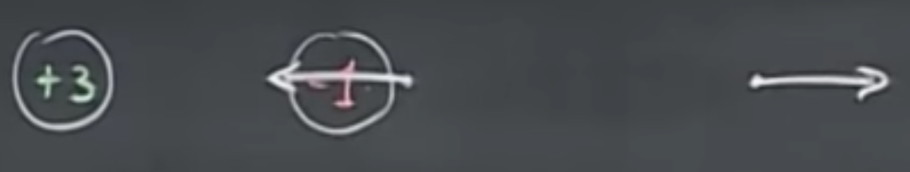

# Electric Fields, Field Lines

If we have a point $p$ with the test charge $q$ somewhere in space, the electric field is the amount of force this test charge experiences, divided by the charge (eliminate the test charge),

$$\vec{E}_p=\frac{\vec{F}}{q}.$$

Note that $\vec{E}_p$ always looks in the direction of the force and has a unit of $N/C$. This is a vector field - expect a bunch of arrows. Positively charged means the arrows are pointing outwards, negatively charged means that these arrows are pointing inward. The arrows are getting “smaller” as we leave the vicinity of the charge as this weakens with the square of the distance.

 
 	
## Superposition
If not one, but a bunch of charges $Q_1,\ldots,Q_i$ act on this point $p$, the electric field emerges as the sum of these individual $\vec{E}_i$ components. Note that $Q_i$ is positively charged, therefore $\vec{E}_1$ is pointing away from $Q_1$, whereas $Q_2$ is negatively charged, therefore it points towards $Q_2$ from $p$.

 

The net electric field is thus

$$E_p = E_1 + \ldots + E_i=\sum_i E_i.$$

The fact that superposition works here is by no means trivial, but it is true. Note that $\vec{F}_p=q\vec{E}$ is also true, therefore if I have a charge, put it somewhere in space, and measure the forces that act upon it, I will be able to reconstruct the electric field. Or, if I have my particle and have the electric field, will be able to know what forces are acting upon it.

If we have a positively and a negatively charged particle, the point near the negative charge will be “sucked in” by it, while as we go further away, we will escape the -1 and get pushed away by the +3. If you are very far away, the -1 and the +3 will be exactly as good as a net +2 charge, i.e., will still point away to the right.

 

However, there will also be a location between these two points where $E=0$.

 

Visualizing the same with field lines, we get this.

 

These lines show that if I would put a particle in this field, they would follow a direction that is tangential to these field lines ($\vec{F}$ in the image above).
Note that all the field lines come in on the -1, and all of them are repelled by the +3.

An intuition for this could be that the +3 is blowing out air, and the -1 is a vacuum cleaner that sucks in the air. The density of the lines can visualize how potent the field is, i.e., the lines can be drawn closer together proportionally to the amount of charges in the field.

Note that in the case of curved field lines, the charges are not obligated to follow them exactly. For instance, in the image below, it may start on the middle line, then get “ejected” towards the line on the top.

 

## The Dipole
A dipole is created when we have two charges with equal magnitude but opposite polarity (one + and one -).

 

As $r \to \infty$, i.e., take a point very far away from the dipole, the two cancel each other out. The dipole is special in a way that in this case, it does not have a square, but a cubic falloff ($1/r^3$).

As seen below, we can create a dipole through induction. The negatively charged rod creates induction, in which the positive and negative charges run in opposite directions, thus separating the two metal spheres.

If we leave a dipole alone in an electric field, the positive charge will want to go in one direction, while the negative in the opposite direction, and therefore, it will start to rotate. When building a dipole, the two spheres have to be connected with a conductor to foster the free exchange of charges. A metal bar will do.

 

When turning on the **Van de Graaff generator** (the big, conducting lollipop), it generates positive charges. Through induction, the electrons are sucked out of the Earth, and want to travel to the positive charges…through us, therefore we get negatively charged. When putting a balloon (the white dot above) made out of a conductor in this force field, it will travel towards us. When it hits our head, it gets negatively charged, and the force will be tangential to the electric field and point backwards to the generator. This goes on and on and the balloon starts bouncing forward and back.

 