# Electric Flux

An open surface, e.g., a sheet of paper or a tissue is placed in an electric field. This surface is carved up into small pieces of size $dA$, each of which has a normal $\hat{n}$.

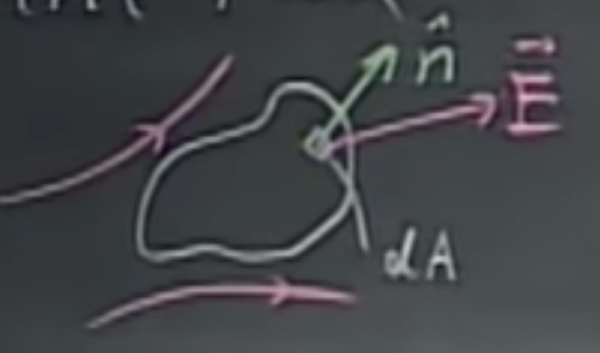 

The electric flux that goes through this surface is given as

$$d\Phi = \vec{E}\cdot \hat{n}dA = \vec{E}\cdot \vec{dA} =  E \, dA \cos \theta,$$ 

where $\theta$ is the angle between $\vec{E}$ and $\hat{n}$. **Note:** the normal is ill-defined for surfaces like this, and we have arbitrarily chosen the normal to point “outwards”.

This is a scalar. Note that $\vec{dA}$ is perpendicular to the element $dA$ as the normal is “baked” into it. The flux through the entirety of the surface is going to be an integral of this. This unit of flux follows from the definition and is $[\frac{N}{C}\,m^2$].

One can think of it as air flowing through a surface defined through its normal. If it lines up with the surface, $\cos0^\circ=1$, if it is perpendicular, nothing goes through, i.e., $\cos90^\circ=0$, and every case is possible in between.

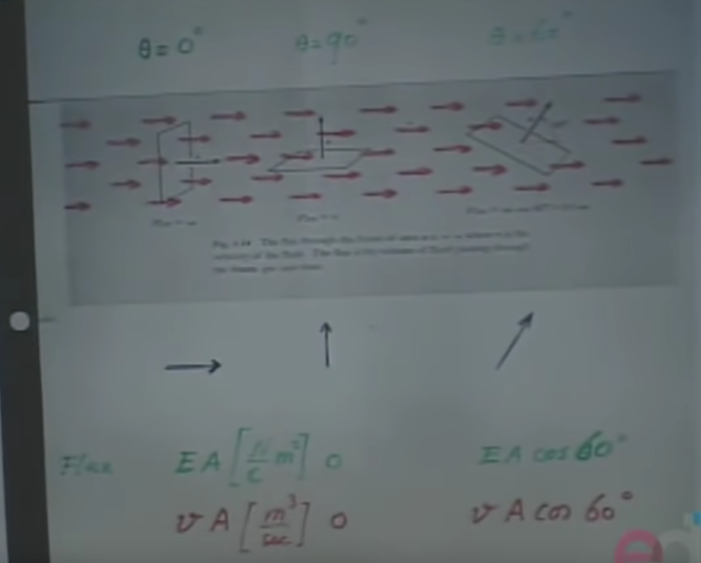 

Let’s perform the flux computation on a closed surface.

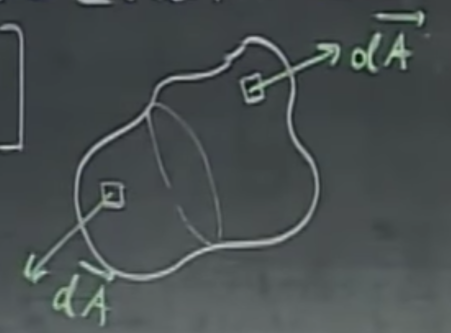 

The total flux going through this closed surface $S$ (will be referred to as the “bag”) is

$$\Phi = \oint_S \vec{E} \cdot \vec{dA}.$$

This is a summation over a collection of dot products, therefore the output is a *scalar*. It is zero if the same amount flows in as what flows out, and can be less or more than zero depending on the imbalance of in and outflows.

    Note: We have a unique definition for normals for closed surfaces.

Let’s take a charge $+Q$ and calculate the flux going through a sphere of radius $R$ around it, where $\hat{r}$ points from the midpoint towards $\vec{dA}$.

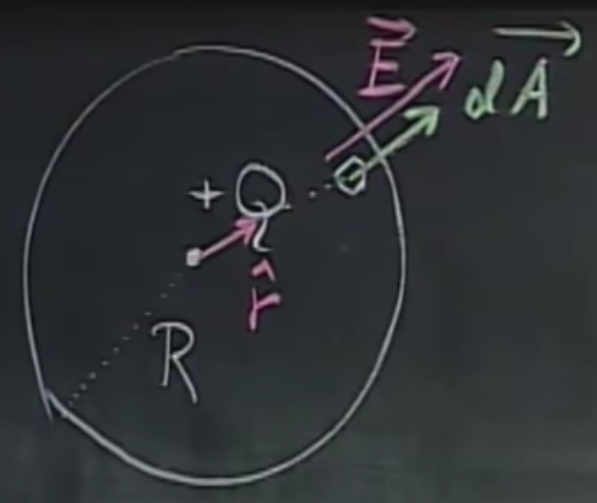 

Noting that $\vec{dA}$ and $\vec{E}$ are parallel, i.e., their dot product is 1, and the surface of the sphere is $4\pi R^2$, we get

$$\Phi =E \, 4\pi R^2,$$

while using Coulomb’s law,  the electric field induced by the charge is

$$\vec{E}_R = \frac{Q}{4 \pi \epsilon_0 R^2}\hat{r},$$

thus yielding

$$\Phi=\frac{Q}{\epsilon_0}.$$

So why would it be independent of the size of the surface it is going through? Well, think of $\vec{E}$ as a result of the charge blowing out air, and all the air has to go somewhere, regardless of the surface we imagine around it.  The air that flows out is the same - we don’t need a sphere for this.

## Gauss’s Law

The electric flux going through a closed surface $S$ is mainly dependent on the charges within this surface, i.e.,

$$\Phi=\oint_S \vec{E}\cdot\vec{dA}=\frac{\sum Q}{\epsilon_0}.$$

Note that Gauss’ law holds independent of the shape of the bag and the charge distribution within the bag. Later, in this course, most of these bags will show different kinds of symmetry, e.g., spherical, cylindrical, or planar.

## Electric field inside and outside of a conductor sphere

Given a hollow, thin shell of a sphere of radius $R$ with $Q$ charge uniformly distributed along its surface. Luckily, this is how conductors behave in reality. We would like to know the electric field in $r$, and thus, through circular symmetry, if we know it at point $r$, we know it at all points $r$ distance away.

Now to choose a Gauss surface that helps us solve this problem. Let’s choose a sphere of radius $r$.

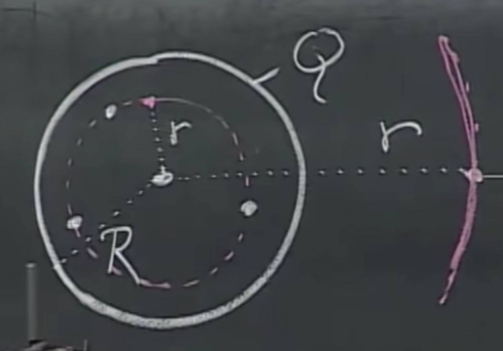 

We know that $\vec{E}$ will either be radially inwards or outwards depending on the sign of $Q$. 

We can lean on the fact that $\vec{E}$ and $\vec{dA}$ are parallel everywhere on the sphere’s surface, the term on the left, $\vec{E}\cdot\vec{dA}$ reduces to $E\,dA \cos\theta$ where $\theta=0$. Then, applying Gauss’s Law, we get

$$E\,4\pi r^2=\frac{Q_{\text{ins}}}{\epsilon_0},$$

And since there are no charges inside the Gaussian surface, $Q_{\text{ins}}$ is $0$, the right side is $0$, therefore $E$ must also be 0. This is the case, provided that $r < R$. 

    To reiterate, the magnitude of the electric field inside a conducting sphere is zero.

In the case where $r > R$, we get

$$E\, 4\pi r^2=\frac{Q}{\epsilon_0}, \\
E= \frac{Q}{4\pi r^2 \epsilon_0}.$$

If we plot the results, we get the following:
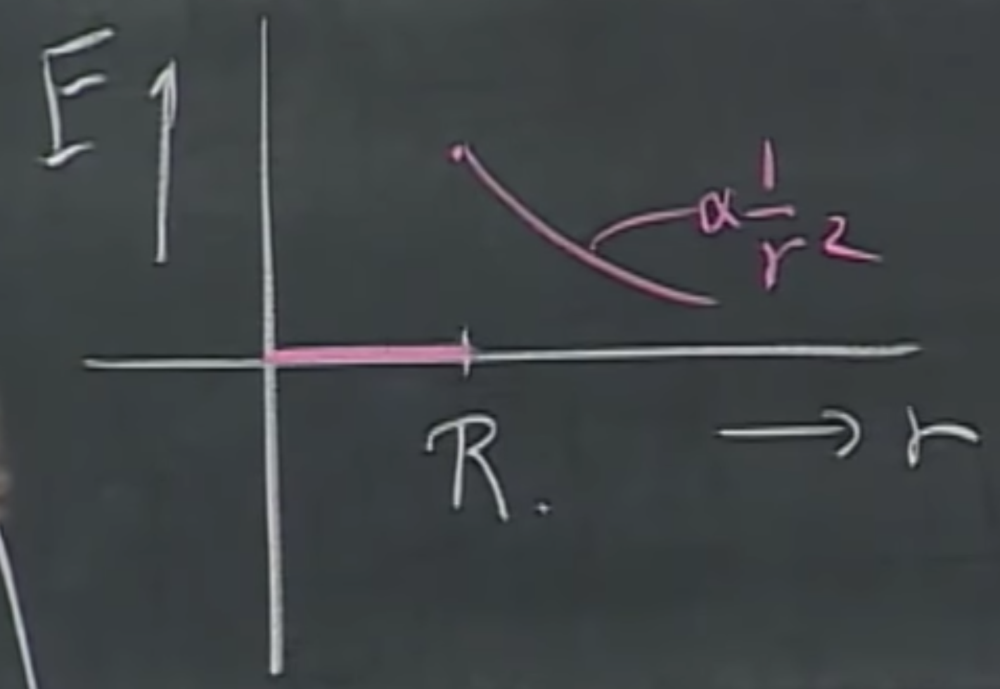 

Note that not only electric, but gravitational forces also fall off proportionally to $1/r^2$, therefore if you would take a hollow, spherical planet with uniform weight distribution, there would be no gravitational field inside. This took Newton 20 years to find out, now you can do it in 30 seconds with Gauss's Law.

This was the first form of symmetry. Now to discuss planar symmetry.

## Electric field around a uniformly charged plane

Think of an infinitely large plane with the same amount of charge everyewhere, $\sigma=Q/A$, with the unit $[C/m^2]$. The question is, what is the electric field ${E}$ anywhere in space? If we pick the Gauss surface correctly, the answer will come immediately, but if we pick a sphere or something lousy, we'll get nowhere. Let's choose a cylindrical surface with a flat plane top and bottom that are parallel to our surface a distance of $d$ above and below the plane.

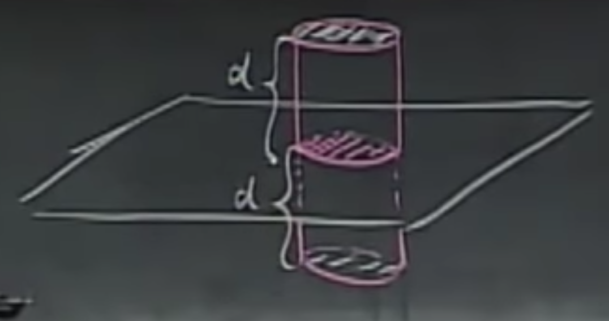 

Interestingly, the electric field of the plane is perpendicular to the surface, therefore because of the scalar product, only the two ends of the Gaussian surface contribute to the electric flux,

$$2EA =\frac{\sigma A}{\epsilon_0} \implies E = \frac{\sigma}{2 \epsilon_0}.$$

Note that due to the scalar product cancellation, the distance $d$ does not appear anywhere in here, thus, this is independent of the distance. I could go miles away from this, and it still has the same electric field. However, to curb our enthusiasm, this is about an *infinitely* extending plane, which, of course, does not exist. Therefore, this would not hold for a finite plane, where it would fall of proportionally to $1/r^2$. Since we've only given the magnitude of the electric field, the directions depend on whether it's positively or negatively charged.

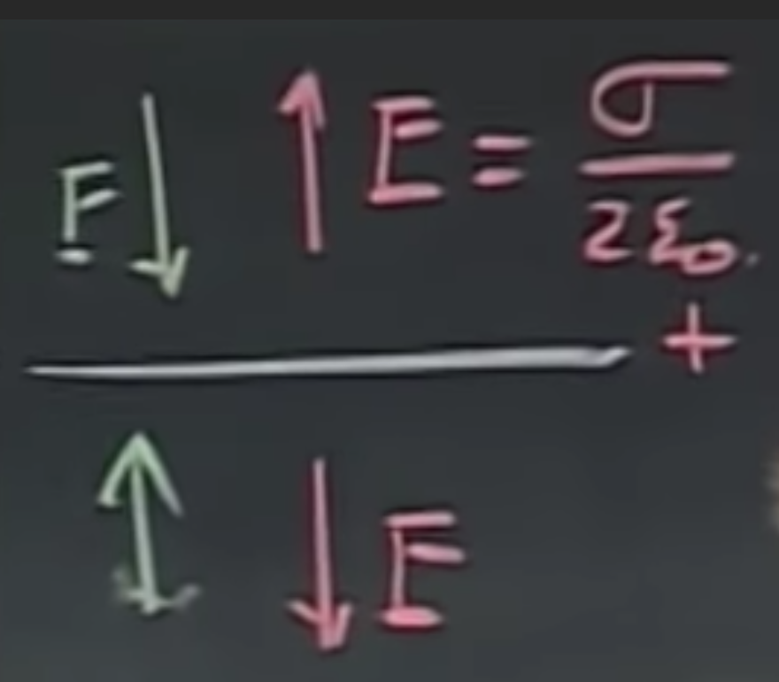

Now let's play with a couple of charged plates of opposite polarities.

## Electric field around charged plates

Suppose we have the setup below.
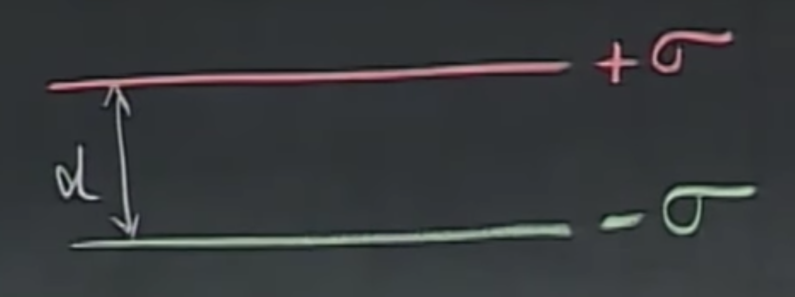

What would be the electric field above, between, and below them? We can start reusing the previous result, write up the electric fields around the plates one by one, and lean on the fact that we've found the $E$ is independent of the distance. Then, we can use the superposition principle and find that above them, the directions are opposing and cancel each other out. Between the plates, the electric flux is magnified (summed), while below, due to symmetry, we have another cancellation, as seen below.

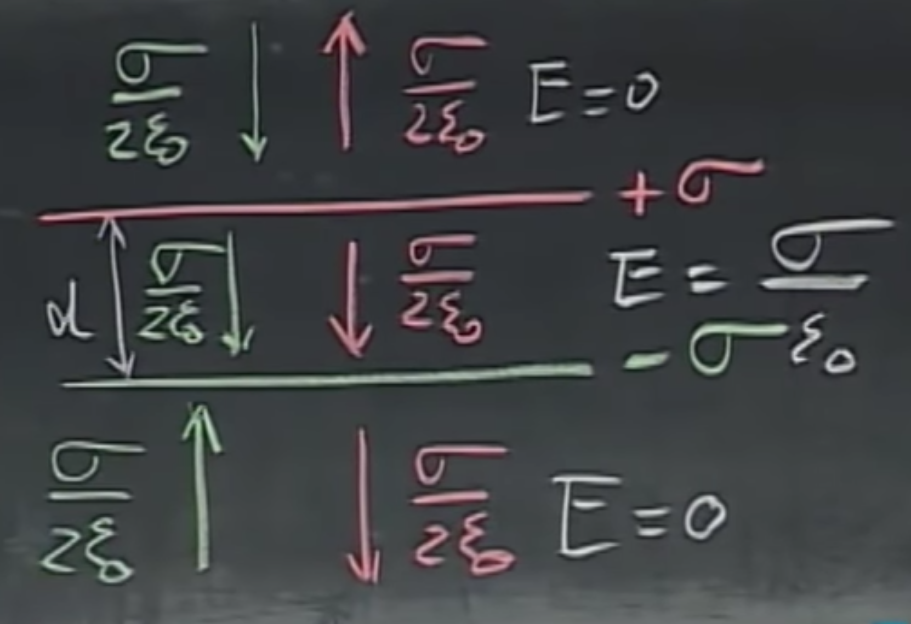

The field lines would point from the positively charged plate to the negatively charged one. This is a very potent eletric field between the two plates, as shown with the density of the field lines in the drawing below for the finite case.

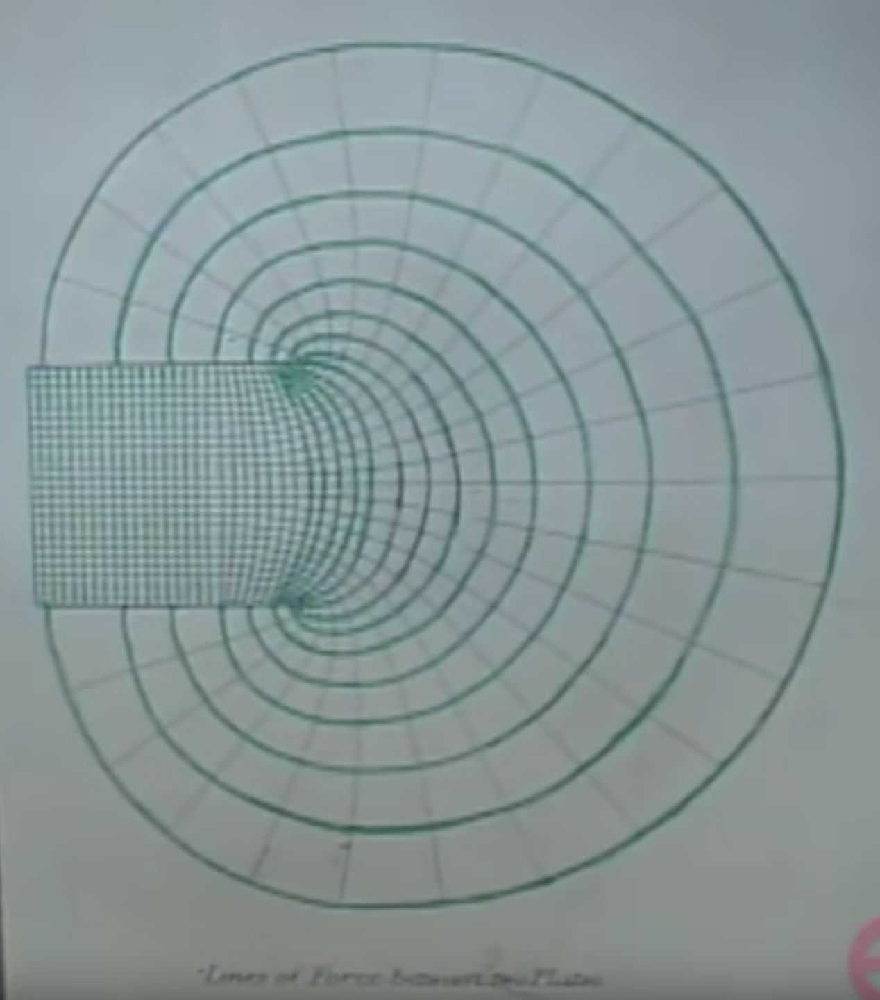

You can see that this must be the finite case because the electric field above and below the two plates is not zero. This was supposedly drawn by Maxwell. I was unable to find the original publication, but if you have time to look through [this](http://strangebeautiful.com/other-texts/maxwell-scientificpapers-vol-i-dover.pdf) and [this](https://archive.org/details/scientificpapers01maxw/page/172/mode/2up) tome and managed to find it, let me know.