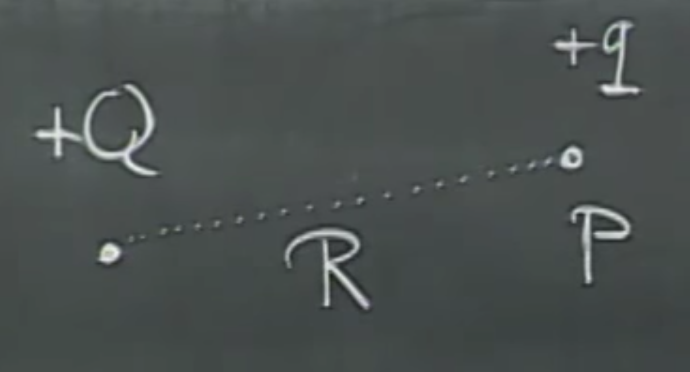
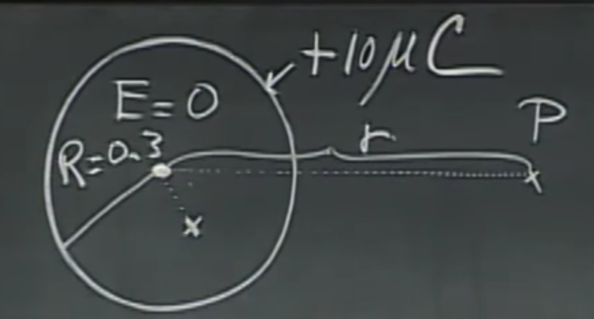
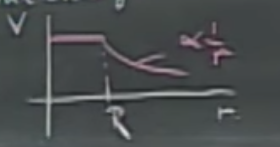

# Electrostatic Potential, Electric Energy, Equipotential Surfaces

# Example of electrostatic potential

Consider two positive charges $q_1,q_2$. Let's place $q_1$ somewhere in space, and start coming towards it from very far away (we'll use $\infty$ in the example) with $q_2$ in our hand. We will have to do some work $F_{WL}$ pushing, since $q_1$ will want to repel it with force $F_{e}$. The target distance is between the charges is $R$, while we are $r$ away. 

How much work do we have to do to accomplish this? Time to whip out the integrals.

$$W_{WL}= \int_{\infty}^{R} \vec{F}_{WL} \, \vec{dr}=\int_{R}^{\infty} \vec{F}_{e} \, \vec{dr}.$$

Note that $\vec{dr}$ is an infinitesimally small displacement - a tiny step that we think of as a vector, and the term within the integral on both sides is a dot product, i.e., $\vec{F} \vec{dr} = \lVert \vec{F} \lVert \, \lVert \vec{dr} \lVert \, \cos \theta$.

The two forces have to be in equilibrium (i.e., the same), but in opposite directions. Hence the integration domains have been flipped. This is useful, because we can evaluate the right side with relative ease.

Let's start evaluating this. On the right side, the electric force $\vec{F}_e$ can be computed via Coulomb's Law, and it will point in the same direction as $\vec{dr}$, which means that $\cos\theta=1$, we can forget about the vectors there, and we can move $\vec{F}_e$ out of the integral, thus, the electrostatic potential energy $U$ will be

$$U=\int_{R}^{\infty} \vec{F}_{e} \, \vec{dr} = \frac{q_1 q_2}{4\pi \epsilon_0} \int_{R}^{\infty}\frac{1}{r^2}dr=\frac{q_1 q_2}{4\pi \epsilon_0} \, \frac{1}{r}\Big\rvert_{R}^{\infty},$$

and continuing the substitution, we get that the work we have to do to bring that charge to the prescribed position is

$$U = \frac{q_1 q_2}{4\pi \epsilon_0 R}.$$

If $q_1,q_2$ are of the same sign, this is going to be a lot of work because we have to push against the will of the electric field. If they are of the opposite polarity, it will be easier, because the electric field will push the two charges together. Everything is pretty nice and *linear* here. Note that we are talking about work here, so the unit will be Joule. Much like gravity fields, the electric forces are also conservative, therefore the work being done is independent of the path taken. I can come in a straight line, or in some crazy staggering trajectory, the required work will be the same.

**Note:** If we have multiple charges, we can write up the same equations with them and use superposition.

# Electric potential

For the configuration below, we have a charge of $+Q$, and a test charge of $+q$ in point $p$ just $R$ distance away.

We already know the electrostatic potential energy, which was

$$U = \frac{q\, Q}{4\pi \epsilon_0 R}.$$

This is the work I have to do to bring the charge $+q$ to point $p$. The **electric potential** is the work *per unit charge* that I have to do to go from $\infty \rightarrow p$. This will be 

$$V_p = \frac{Q}{4\pi \epsilon_0 R}.$$

And is also a scalar and has a unit of $J/C$, or $V$, in short (yes, this is Volt). This makes sense, as the further away $p$ is, the bigger $R$ is, the less work we have to do. Of course, the higher $Q$ is, the more work we have to do. Both are nice and linear, hooray! 

**Note:** that this potential can be negative, of course, when we have a negative $Q$.

Now, we would like to know the electric potential around a Van de Graaff generator, a hollow sphere with the radius $R=0.3$ and and the charge of $+10 \mu C$, uniformly distributed (which follows from the fact that it is a conductor). What is the eletric potential at any point is space? Let's take the example of a point $p$ a distance $r$ away.

$$V_p=\int_{r}^{\infty}\frac{\vec{F}_e}{q}\vec{dr}=\int_{r}^{\infty}\vec{E}\,\vec{dr}=\frac{Q}{4\pi \epsilon_0 r},$$
which is, of course, only true outside of the sphere, $r>R$. If we substitute the $r=R=0.3$ (we're on the surface of the sphere) and $Q=+10 \mu C$, we get $V_p=3.10^5V$. The work I have to do to bring the charge $q$ in my pocket to the Van de Graaff would be

$$W_{WL}=q\,V_p$$

Note that **potential is work per unit charge**, where if I put the amount of charge I need to carry back into the equation, I get **work**. This will be a lot of work - the same amount as climbing the Empire State Building. Better start working out!

As we approach the sphere, inside, due to the lack of the electric field, it will suddenly become much easier to carry this charge forward.
