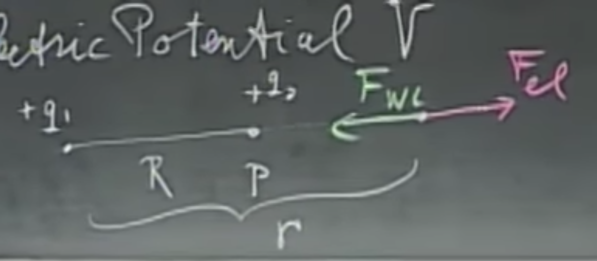

# Electrostatic Potential, Electric Energy, Equipotential Surfaces

Consider two positive charges $q_1,q_2$. Let's place $q_1$ somewhere in space, and start coming towards it from very far away (we'll use $\infty$ in the example) with $q_2$ in our hand. We will have to do some work $F_{WL}$ pushing, since $q_1$ will want to repel it with force $F_{el}$. The target distance is between the charges is $R$, while we are $r$ away. 

How much work do we have to do to accomplish this? Time to whip out the integrals.

$$W_{WL}= \int_{\infty}^{R} \vec{F}_{WL} \, \vec{dr}=\int_{R}^{\infty} \vec{F}_{el} \, \vec{dr}$$

Note that $\vec{dr}$ is an infinitesimally small displacement - a tiny step that we think of as a vector, and the term within the integral on both sides is a dot product, i.e., $\vec{F}_{} \vec{dr} = ||\vec{F}|| \,||\vec{dr}|| \, \cos\theta$.

The two forces have to be in equilibrium (i.e., the same), but in opposite directions. Hence the integration domains have been flipped. 

Let's start evaluating this. On the right side, the electric force $\vec{F}_{el}$ can be computed via Coulomb's Law, and it will be in the same direction as $\vec{dr}$, which means that $\cos\theta=1$, we can forget about the vectors there, and we can move $\vec{F}_{el}$ out of the integral,

$$U=\int_{R}^{\infty} \vec{F}_{el} \, \vec{dr} = \frac{q_1 q_2}{4\pi \epsilon_0} \int_{R}^{\infty}\frac{1}{r^2}dr=\frac{q_1 q_2}{4\pi \epsilon_0} \, \frac{1}{r}\Big\rvert_{R}^{\infty},$$

thus, the work we have to do to bring that charge to the prescribed position is

$$U = \frac{q_1 q_2}{4\pi \epsilon_0 R}.$$

If $q_1,q_2$ are of the same sign, this is going to be a lot of work because we have to push against the will of the electric field. If they are of the opposite polarity, it will be easier, because the electric field will push the two charges together. Everything is pretty nice and *linear* here. Note that we are talking about work here, so the unit will be Joule. Much like gravity fields, the electric forces are also conservative, therefore the work being done is independent of the path taken. I can come in a straight line, or in some crazy staggering trajectory, the required work will be the same.