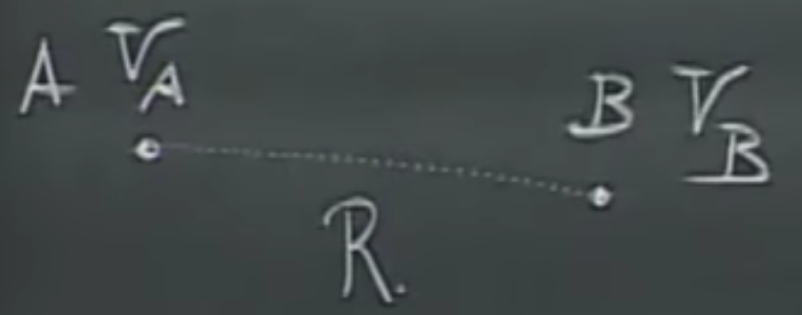
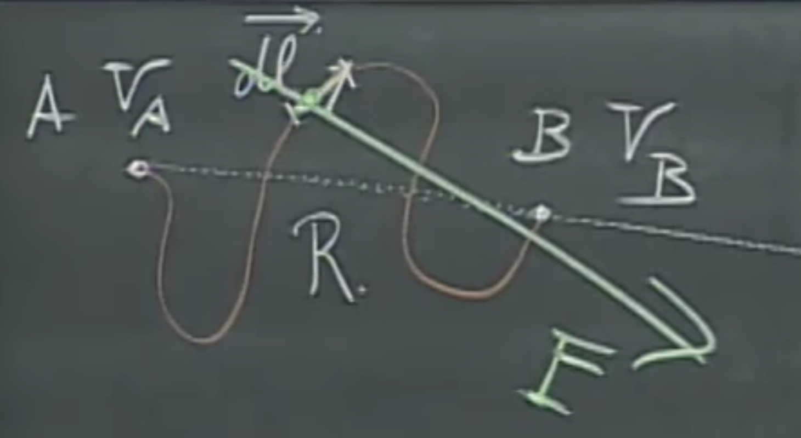
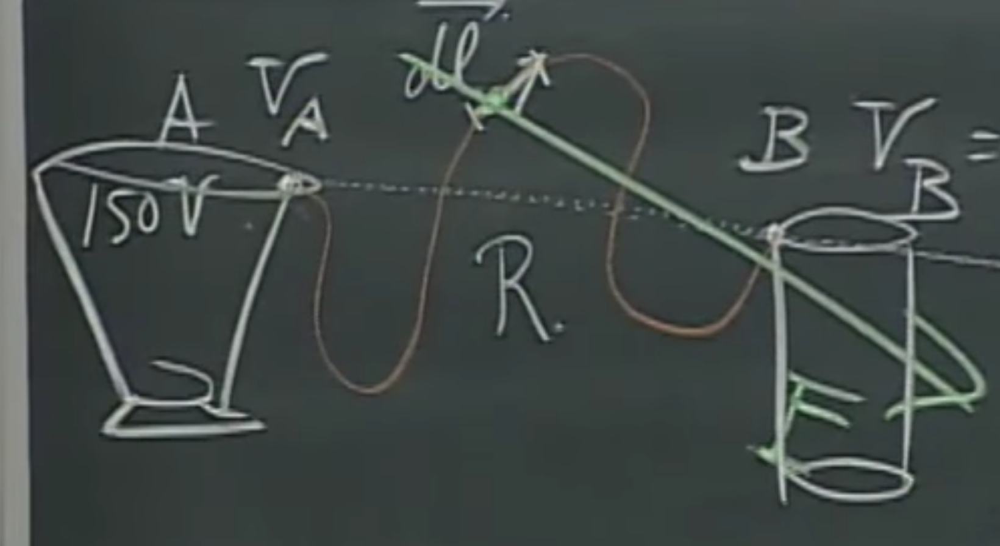
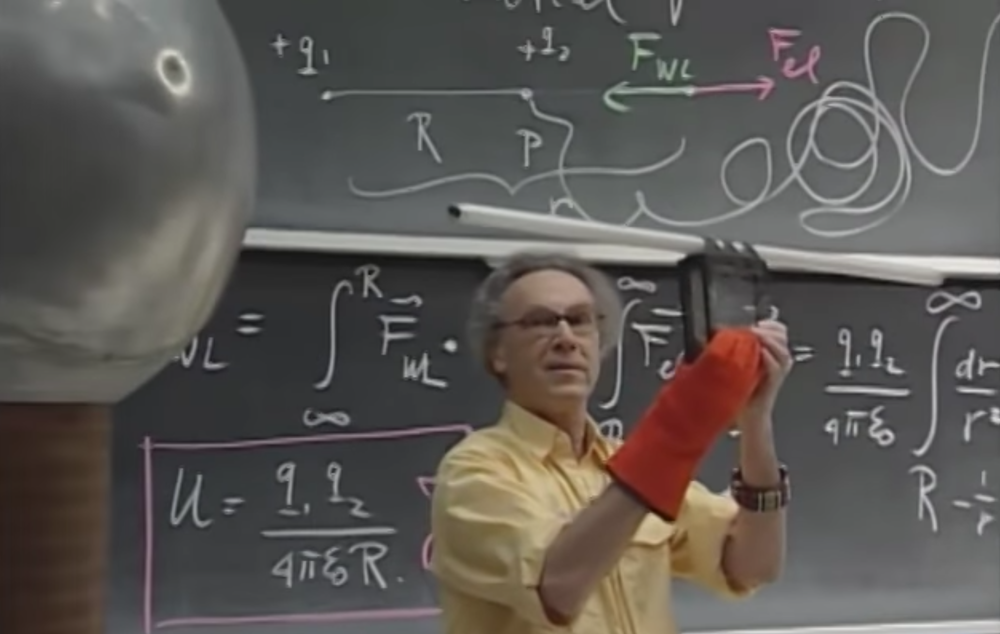
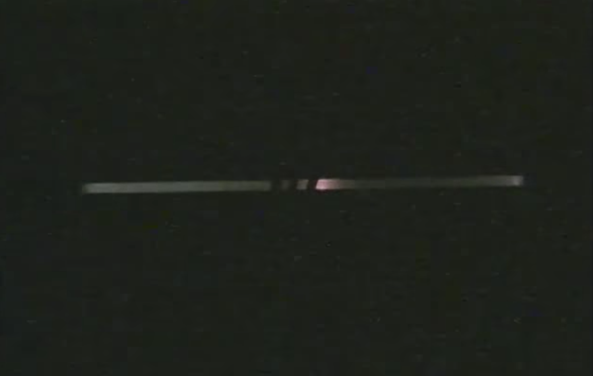
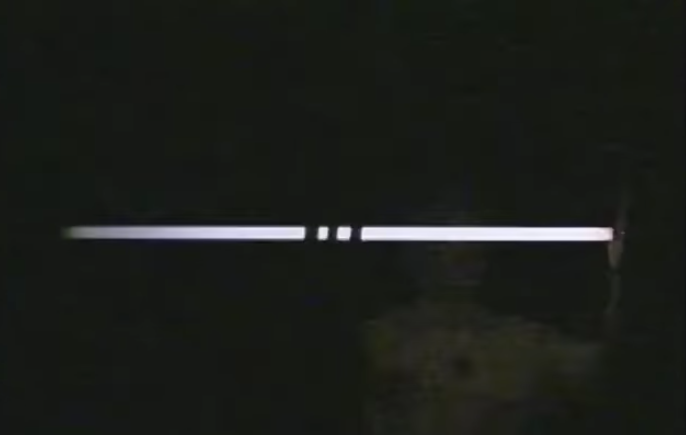

# Electrostatic Potential, Electric Energy, Equipotential Surfaces

# Example of electrostatic potential

Consider two positive charges $q_1,q_2$. Let's place $q_1$ somewhere in space, and start coming towards it from very far away (we'll use $\infty$ in the example) with $q_2$ in our hand. We will have to do some work $F_{WL}$ pushing, since $q_1$ will want to repel it with force $F_{e}$. The target distance is between the charges is $R$, while we are $r$ away. 

How much work do we have to do to accomplish this? Time to whip out the integrals.

$$W_{WL}= \int_{\infty}^{R} \vec{F}_{WL} \cdot \vec{dr}=\int_{R}^{\infty} \vec{F}_{e} \cdot \vec{dr}.$$

Note that $\vec{dr}$ is an infinitesimally small displacement - a tiny step that we think of as a vector, and the term within the integral on both sides is a dot product, i.e., $\vec{F} \vec{dr} = \lVert \vec{F} \rVert \, \lVert \vec{dr} \rVert  \cos \theta$.

The two forces have to be in equilibrium (i.e., the we have to counteract the electric field with the same amount of work), but in opposite directions. Hence the integration domains have been flipped. This is useful, because we will be able to evaluate the right side with relative ease.

But wait a second, what really happened here?

## The Magic Switcheroo

This is an additional note I added here, because I think the integration boundary flipping above is a little more involved than it might seem at first. At first sight, switching from $\int_{\infty}^R$ to $\int_R^{\infty}$ sounds fine. After all, we just walk along the function and add together things, does it really matter in what order we do it? *Yes it does!* Let me explain. If we would be doing a normal addition, no, it wouldn't matter, however, a Riemann integral gives us the **signed area** under the function, which is different when walking from left to right, or right to left. Not intuitive? This is a great lesson - sometimes, intuition only takes us so far, and we have to derive and prove our statements properly to really understand what is going on.

In this case, we have two beautiful ways of doing this.

### Explanation one

Consider the [fundamental theorem of calculus](https://en.wikipedia.org/wiki/Fundamental_theorem_of_calculus), where given $F'(x)=f(x)$, then a definite integral is defined as

$$\int_a^b f(x) \, dx = F(b) - F(a).$$

So, $F$(upper bound) minus $F$(lower bound). Now let's switch the integration domains to go from $b$ to $a$. We get

$$F(b) - F(a)=-(F(a) - F(b))=-\int_b^a f(x) \, dx,$$

therefore we can perform this switcheroo, provided that we multiply the integral by $-1$, because of the signed area argument above,

$$\int_a^b f(x) \, dx = -\int_b^a f(x) \, dx.$$

Thank you for [this source](https://math.stackexchange.com/questions/1316529/why-does-an-integral-change-signs-when-flipping-the-boundaries) for the explanation. It can also be explained in a different way, which is quite cool.

### Explanation two
A fundamental property of integrals if we have $a \leq b \leq c$, then we can break up the integration bounds as

$$\int_a^b f(x) \, dx + \int_b^c f(x) \, dx = \int_a^c f(x) \, dx$$

Now let's use the substitution of $a \leftarrow c$, i.e., swap both $c$'s for $a$'s,

$$\int_a^b f(x) \, dx + \int_b^a f(x) \, dx = \int_a^a f(x) \, dx.$$

Note that $\int_a^a f(x) \, dx=0$, therefore by reordering, we immediately get 

$$\int_a^b f(x) \, dx = -\int_b^a f(x) \, dx.$$

Very elegant and absolutely beautiful. Again, thank you for [this source](https://math.stackexchange.com/questions/1316529/why-does-an-integral-change-signs-when-flipping-the-boundaries) for the explanation.

# Back to the example of electrostatic potential
But we are still not done yet. There is no sign change between the two integrals we wrote, i.e.,

$$\int_{\infty}^{R} \vec{F}_{WL} \cdot \vec{dr}=\int_{R}^{\infty} \vec{F}_{e} \cdot \vec{dr}.$$

Where did the minus sign go? If you look at the image above, you'll see that $F_{WL}$ and $F_{e}$ look in the opposite direction, therefore the $-1$ multiplier is "baked into" that relationship. So this is the story of the Magic Switcheroo. **All hail the Magic Switcheroo!** This was not trivial for me, at least not for the first sight, and hence I put here this explanation. If it was trivial for you, please stop reading this - go and build a time machine or something.

Now let's start evaluating this. On the right side, the electric force $\vec{F}_e$ can be computed via Coulomb's Law, and it will point in the same direction as $\vec{dr}$, which means that $\cos\theta=1$, we can forget about the vectors there, and we can move $\vec{F}_e$ out of the integral, thus, the electrostatic potential energy $U$ will be

$$U=\int_{R}^{\infty} \vec{F}_{e} \, \vec{dr} = \frac{q_1 q_2}{4\pi \epsilon_0} \int_{R}^{\infty}\frac{1}{r^2}dr=\frac{q_1 q_2}{4\pi \epsilon_0} \, \frac{1}{r}\Big\rvert_{R}^{\infty},$$

and continuing the substitution, we get that the work we have to do to bring that charge to the prescribed position is

$$U = \frac{q_1 q_2}{4\pi \epsilon_0 R}.$$

If $q_1,q_2$ are of the same sign, this is going to be a lot of work because we have to push against the will of the electric field. If they are of the opposite polarity, it will be easier, because the electric field will push the two charges together. Everything is pretty nice and *linear* here. Note that we are talking about work here, so the unit will be Joule. Much like gravity fields, the electric forces are also conservative, therefore the work being done is independent of the path taken. I can come in a straight line, or in some crazy staggering trajectory, the required work will be the same.

**Note:** If we have multiple charges, we can write up the same equations with them and use superposition.

# Electric potential

Why do we need this? Soon, you will see that electric potentials can easily tell us **how things should move** in an electric field.

For the configuration below, we have a charge of $+Q$, and a test charge of $+q$ in point $p$ just $R$ distance away.

We already know the electrostatic potential energy, which was

$$U = \frac{q\, Q}{4\pi \epsilon_0 R}.$$

This is the work I have to do to bring the charge $+q$ to point $p$. The **electric potential** is the work *per unit charge* that I have to do to go from $\infty \rightarrow p$. This will be 

$$V_p = \frac{Q}{4\pi \epsilon_0 R},$$

which is also a scalar and has a unit of $J/C$, or $V$, in short (yes, this is Volt). This makes sense, as the further away $p$ is, the bigger $R$ is, the less work we have to do. Of course, the higher $Q$ is, the more work we have to do. Both are nice and linear, hooray! 

**Note:** that this potential can be negative, of course, when we have a negative $Q$.

Now, we would like to know the electric potential around a Van de Graaff generator, a hollow sphere with the radius $R=0.3$ and and the charge of $+10 \mu C$, uniformly distributed (which follows from the fact that it is a conductor). What is the eletric potential at any point is space? Let's take the example of a point $p$ a distance $r$ away.

$$V_p=\int_{r}^{\infty}\frac{\vec{F}_e}{q}\cdot\vec{dr}=\int_{r}^{\infty}\vec{E}\cdot\vec{dr}=\frac{Q}{4\pi \epsilon_0 r},$$

which is, of course, only true outside of the sphere, $r>R$. If we substitute the $r=R=0.3$ (we're on the surface of the sphere) and $Q=+10 \mu C$, we get $V_p=3.10^5V$. The work I have to do to bring the charge $q$ in my pocket to the Van de Graaff would be

$$W_{WL}=q\,V_p.$$

Note that **potential is work per unit charge**, where if I put the amount of charge I need to carry back into the equation, I get **work**. Approaching this Van de Graaff generator will be a lot of work - the same amount as climbing the Empire State Building. Better start working out!

As we approach the sphere, inside, due to the lack of the electric field that pushes us away, it will suddenly become much easier to carry this charge forward.

## Equipotential surfaces

We can create the potential field around multiple charges by using superposition, or in other words, computing the individual potential fields and adding them together.
And now, with green, you see below the field lines around two positive charges - they look outwards as there is plenty of repelling going on. The red lines denote the equipotential surface that emerges from this field.

Note that if we are very far away from these charges, the equipotential surface is going to resemble a sphere as when $r \to \infty$, the electric field is going to be similar to a net $+5$ charge's field. You can see this above as well - as we go farther away from the charges, the equipotential surfaces become more spherical (also the same when we are very close by to the charges). There is also a point between the two charges where the electric field is zero. This, of course, does not mean that the potential is zero there, we have to do work to get to that point - however, when we do, we can rest in that point.

**Note:** The field lines and equipotential surfaces are perpendicular to each other.

Now, let's do the same around a $+4$ and $-1$ charge. The green lines show that the positive charge behaves like a hairdryer, while the negative charge is a vacuum cleaner. The equipotential surfaces, again look spherical close by around the $+4$ and very far away too.

But we have some blue lines there too. What is going on? Well, we have a negative charge, which sucks our test charge in without us having to do any work, therefore, we have a negative equipotential surface around it! Also, there is a red sphere above it (I keep using the word sphere because these are 2D slices of the 3D world), therefore, somewhere between the blue and the red spheres, there has to be a surface of zero potential too! Note that this absolutely does not mean that the electric field would be zero there. The potential part means that when we come from $\infty$ with a test charge in our pocket, we'll do some amount of positive work, then some negative work, and the sum of the two will be zero at some points.

There is, also a point in space highlighted with $E=0$ where the magnitude of the electric field is zero, but of course, it is between two red spheres, so the potential is positive there - we can't get there "for free", if by free we mean segments of positive and negative work summed up to zero.

**Note:** Equipotential surfaces never intersect each other. This would be a violation of energy conservation.
**Note:** Do not confuse the electrostatic potential energy $U$ with the electric potential $V$. The first is measured in $J$, the second is $J/C$.

## Movement between potentials

So why do we need all this equipotential stuff? We can compute all this if we know $\vec{E}$ well enough everywhere. Yes, however, there are cases where $\vec{E}$ is prohibitively complicated, and working with equipotential surfaces can get much easier than that.

In an electric field, positive charges will move from a higher potential to a lower potential. As a key difference from gravity, negative charges also exist that travel in the other direction.

Now, we noted earlier that that if we have a point $A$ and $B$ a distance of $R$ apart, their appropriate potentials are defined as

$$V_A=\int_{A}^{\infty}\vec{E} \cdot \vec{dr}, \\
V_B=\int_{B}^{\infty}\vec{E} \cdot \vec{dr}.$$

And thus, when we compute the difference in their potential, we cancel out the "to infinity" part, and what remains will be as follows,

$$V_A-V_B=\int_{A}^{B}\vec{E} \cdot \vec{dr}, \\
V_B-V_A=-\int_{A}^{B}\vec{E} \cdot \vec{dr}.$$

The one below is not a shallow mathematical exercise in changing signs, but the way you will probably encounter potential differences in other literature.

Note that to get the notation that is traditionally used everywhere, we have to introduce $\vec{dl}$. While $\vec{dr}$ was our vector pointing from $A$ to $B$, $\vec{dl}$ will be an infinitely small distance (with direction) along an arbitrary path between $A$ and $B$. Writing the same equations with $\vec{dl}$ is the same only because electric fields are conservative fields, which does not mean that they vote for populists, but that the work being done is independent from the trajectory between the two points. In the interest of brevity, I will not rewrite the previous equations here again, but do not get confused if we use $\vec{dl}$ as the integration variable later.

Let's assign $V_A=150V$ and $V_B=50V$, then, if Walter Lewin goes from infinity to $A$ or $B$ with $+q$ charge in his pocket, how much work does he have to do? Note that again, **potential is work per unit charge**, therefore, to get the work back, we have to multiply with $q$,

$$W_{WLA}=q V_B=150q, \\
W_{WLB}=q V_A=50q.$$

If he wishes to go to $A$, he has to do a lot more work than he did walking towards $B$, because the charge wants to go from the higher to lower potential, and we have to work against that. Now, if we leave the charge alone in $A$, it will travel to $B$ by itself. How much energy is released during this journey? A change in potential energy will be

$$q(V_A-V_B)=K_B-K_A$$

The right side shows the kinetic energies before and after the application of force (kinetic energies at point $B$ and $A$) and the equality comes from the Work-Energy Theorem, i.e., the work done by the net force on the particle (left side) equals the change in the particle's kinetic energy. In other words, the difference in potentials will lead to the same difference in kinetic energy. Finally, we can connect these potentials to our known world: they have a nice and clear way of describing movement in an electric field. It also connects back to Newtonian physics. Slam dunk.

**Metals are equipotential surfaces**, as long as there is no charge moving inside them. When induction happens, the charges move automatically until there is no force on them anymore (they try to "kill" the electric field).

## Charged trashcans

I hope you've grown to like this point $A$ and $B$ because we will have a third figure about them. After that, the will go into the trash. You know what? In fact, let's attach them to metal trashcans right now.

How would the particles travel between these? If we would put an electron into point $B$, it will want to travel towards $A$, because a negative charge goes from lower to higher potential, a proton would move the other way around. Because of the complex shapes of the trashcans, the electric would be very hard to compute, but if we only want to know the speed or kinetic energy of this movement, it becomes a simple substitution of the charge times potential difference. Let's do it. It will be

$$1.6 \cdot 10^{-19} \cdot 100=\frac{1}{2} m_e v_A^2$$

where $m_e$ is the mass of the electron and $v_A$ is the speed at point $A$. We can do all this without any knowledge of the electric field. So simple!

Note that we compute potentials as if we were coming from infinity, and the $1/r^2$ term is $0$ in infinity. Also, note that only the *difference* in the potentials matter, the magnitude of the potentials does not. This means that $50V$ against $150V$ in terms of kinetic energy is equivalent to $0V$ vs $100V$ or $50V$ against $-50V$. In engineering applications, the potential of the Earth is typically set at $0V$.

## Creating light

Now, let's create light with an experiment! If we hold this glass tube (with gas inside) next to the Van de Graaff generator in a way that maximizes the potential difference, which is, in a radially outwards direction, induction happens, and electrons start moving through the gas, creating light. Now we have something derived from theory that already has some really useful engineering applications. Great!

Before turning the room lights off:

After:

If we would hold this in a tangential direction, because we haven't studies physics, we get, of course, nothing. As we start turning from the tangential direction to radially outwards, it slowly lights up. And we know exactly why! We now see that the potential difference created by an electric field can make lights work. What a beautiful experiment.

Of course, Walter Lewin adds one more twist to this by touching the further end of the tube. What happens here is that because the excess charge travels through his body into the Earth, the tube lights up even more.

However, every touch hurts like mad, but a proper teacher goes the extra mile to make you understand electric potentials. Darth Maul would be proud of this. Embrace the power of the dark side, young Padawan. Also, if you are at MIT, you get your tuition fee's worth with this one for sure. There is another experiment at the end of [this lecture](https://www.youtube.com/watch?v=QpVxj3XrLgk&list=PLyQSN7X0ro2314mKyUiOILaOC2hk6Pc3j&index=5), but it only makes sense in motion, so make sure to have a look.