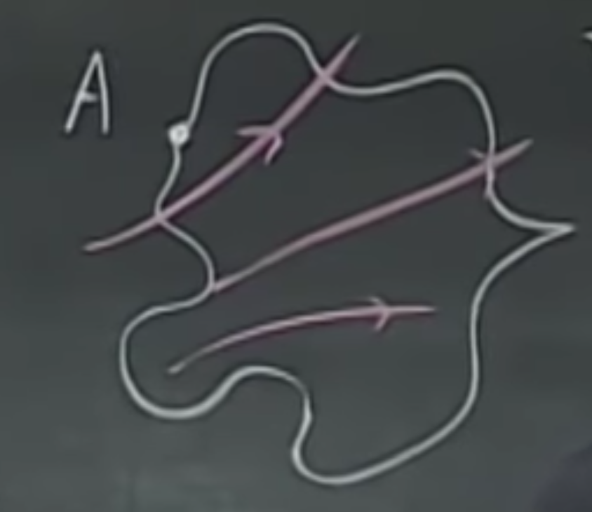
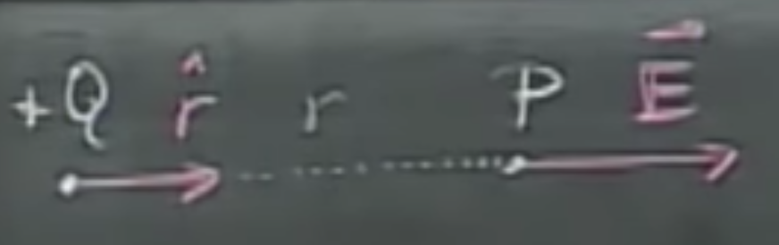
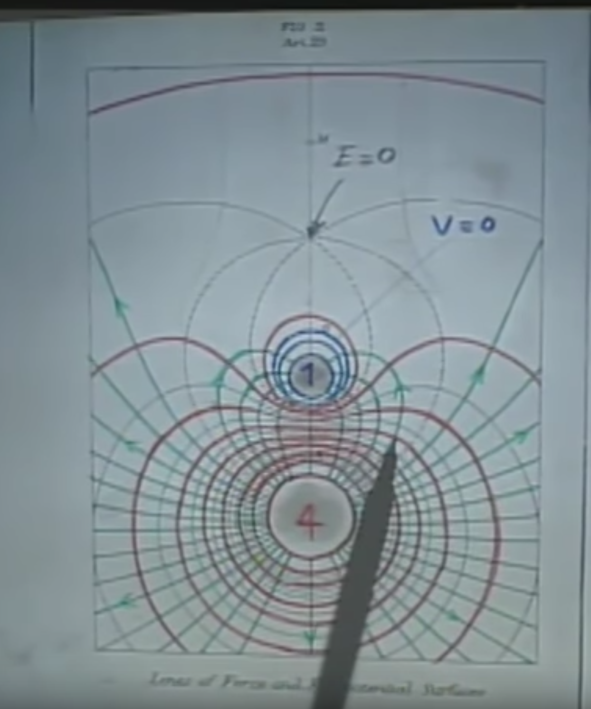

# $E= - \nabla V$, Conductors, Electrostatic Shielding

## So, what's up with $E= - \nabla V$?

If we take a closed line $L$ in a static electric field with no charges moving around,

$$\oint_L \vec{E}\cdot\vec{dl}=0$$

will hold. This is a little more interesting than it seems at the first sight - for instance, if we march around in a closed surface, but ending up at the same point as seen below, the work (potential difference) we have to do is zero, i.e.,

$$V_A-V_A=0=\oint_A^A \vec{E}\cdot\vec{dl}$$

Again, note that this is an integral along a closed line, not a closed surface. Now, as potentials are defined as integrals over the electric field, if we are given potentials and would like to obtain the field, we will have to use derivatives. Let's try to produce this for a point charge.

We know the electric field to be

$$\vec{E} = \frac{Q}{4 \pi \epsilon_0 r^2}\hat{r}$$

and the potential in each point from before,

$$V = \frac{Q}{4\pi \epsilon_0 r}.$$

Now what we are looking for $(dV/dr)\hat{r}$, and since everyone else but $r$ is a constant, the derivative will be

$$\frac{dV}{dr}\hat{r}=-\frac{Q\hat{r}}{4\pi \epsilon_0 r^2}.$$

The star of the show is the negative sign here. Intuitively, in $V$, $r$ is in the denominator, therefore if I increase $r$, $V$ will decrease, so $dV/dr$ has to have a negative sign. It makes sense as we have to work against the electric field. Mathematically, all we did was use the fact that 

$$\frac{d}{dx}x^n=nx^{n-1},$$

and here, $n=-1$ as $1/r=r^{-1}$. I know this is kindergarten mathematics for you (especially for Time Machine Guy, are you still here?), but just wanted to make sure. Also, $\hat{r}$ materialized on both sizes, not due to some forbidden wizardry, but it was just a mutiplication on both sides with a unit vector. No arcane magic was used here. We'll have to wait until Maxwell's equations for that.

Now, this is almost the same as $\vec{E}$, but there is a minus sign. Those pesky minus signs often come up when computing derivatives.

$$\vec{E}=-\frac{dV}{dr}\hat{r}.$$

Let's not just stare at this, but try to build a small piece of intuition, which would be that the electric field and potentials are closely related, and both can be computed from each other.

**Note:** Of course, if we are only interested in the magnitude, but not the direction of the electric field, the non-vector version of this can also be written as $E=-dV/dr$.

## Equipotential surfaces - why perpendicular to $\vec{E}$?
If I have a charge in my pocket, and I move only in a way that is perpendicular to the field lines. This way, the force that acts upon me and the direction I go are always in $90^\circ$ away. Of course, thus, their dot product is zero. 

As you remember, the potential is work per unit charge, therefore I can use the potential as a proxy for work when I only have this unit charge. This will be given as
$$V_p=\int_{r}^{\infty}\vec{E}\cdot\vec{dl},$$
in which, the dot product between these is zero, therefore we do zero work. These zero work regions are by definition, equipotential surfaces and have to be perpendicular to $\vec{E}$. (I hope you still remember the story of $dr$ and $dl$.)

If we revisit Maxwell's drawing of the +4 and -1 charge, if you put your pen onto an intersection point between the two (see the example below), you will always find them to be perpendicular.

We know from before that it is also true that if we release a charge freely in an electric field, it will move as the field lines guides it. It is still true for a negative charge, which will go in the opposite of the field line directions.

## So, finally… what's up with $E= - \nabla V$?

We are now very close to settling this!

If we have an electric field, where we go a unit distance in the direction of $x$ and measure a difference in potential (while keeping $y$ and $z$ constant, hence the notation on the right), we get

$$E_x=\frac{dV}{dx}\rvert_{yz=c}$$

Thus, the unit of $E$ is $[V/m]$, which is the same as we wrote before. However, this is a little more intuitive - if you move away a meter of distance, this is the amount of difference in potential you will experience. This is potential change over a distance.