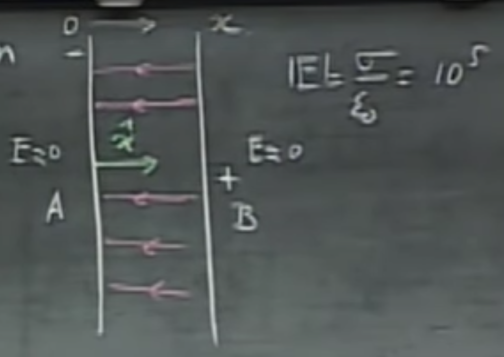

# $E= - \nabla V$, Conductors, Electrostatic Shielding

## So, what's up with $E= - \nabla V$?

We don't yet know about the nabla operator ($\nabla$) in the title, but whatever it is, it seems to be a very elegant way of creating a connection between electric fields and potentials. We'll talk about it and define it as soon as we can, but let's lay down some groundwork to be able to do that.
 
If we take a closed line $L$ in a static electric field with no charges moving around,

$$\oint_L \vec{E}\cdot\vec{dl}=0$$

will hold. This is a little more interesting than it seems at the first sight - for instance, if we march around in a closed surface, but ending up at the same point as seen below, the work (potential difference) we have to do is zero, i.e.,

$$V_A-V_A=0=\oint_A^A \vec{E}\cdot\vec{dl}$$

Again, note that this is an integral along a closed line, not a closed surface. Now, as potentials are defined as integrals over the electric field, if we are given potentials and would like to obtain the field, we will have to use derivatives. Let's try to produce this for a point charge.

We know the electric field to be

$$\vec{E} = \frac{Q}{4 \pi \epsilon_0 r^2}\hat{r}$$

and the potential in each point from before,

$$V = \frac{Q}{4\pi \epsilon_0 r}.$$

Now what we are looking for $(dV/dr)\hat{r}$, and since everyone else but $r$ is a constant, the derivative will be

$$\frac{dV}{dr}\hat{r}=-\frac{Q\hat{r}}{4\pi \epsilon_0 r^2}.$$

The star of the show is the negative sign here. Intuitively, in $V$, $r$ is in the denominator, therefore if I increase $r$, $V$ will decrease, so $dV/dr$ has to have a negative sign. It makes sense as we have to work against the electric field. Mathematically, all we did was use the fact that 

$$\frac{d}{dx}x^n=nx^{n-1},$$

and here, $n=-1$ as $1/r=r^{-1}$. I know this is kindergarten mathematics for you (especially for Time Machine Guy, are you still here?), but just wanted to make sure. Also, $\hat{r}$ materialized on both sizes, not due to some forbidden wizardry, but it was just a mutiplication on both sides with a unit vector. No arcane magic was used here. We'll have to wait until Maxwell's equations for that.

Now, this is almost the same as $\vec{E}$, but there is a minus sign. Those pesky minus signs often come up when computing derivatives.

$$\vec{E}=-\frac{dV}{dr}\hat{r}.$$

Let's not just stare at this, but try to build a small piece of intuition, which would be that the electric field and potentials are closely related, and both can be computed from each other.

**Note:** Of course, if we are only interested in the magnitude, but not the direction of the electric field, the non-vector version of this can also be written as $E=-dV/dr$.

## Equipotential surfaces - why perpendicular to $\vec{E}$?
If I have a charge in my pocket, and I move only in a way that is perpendicular to the field lines. This way, the force that acts upon me and the direction I go are always in $90^\circ$ away. Of course, thus, their dot product is zero. 

As you remember, the potential is work per unit charge, therefore I can use the potential as a proxy for work when I only have this unit charge. This will be given as
$$V_p=\int_{r}^{\infty}\vec{E}\cdot\vec{dl},$$
in which, the dot product between these is zero, therefore we do zero work. These zero work regions are by definition, equipotential surfaces and have to be perpendicular to $\vec{E}$. (I hope you still remember the story of $dr$ and $dl$.)

If we revisit Maxwell's drawing of the +4 and -1 charge, if you put your pen onto an intersection point between the two (see the example below), you will always find them to be perpendicular.

We know from before that it is also true that if we release a charge freely in an electric field, it will move as the field lines guides it. It is still true for a negative charge, which will go in the opposite of the field line directions.

## So, finally… what's up with $E= - \nabla V$?

We are now very close to settling this!

If we have an electric field, where we go a unit distance in the direction of $x$ and measure a difference in potential (while keeping $y$ and $z$ constant, hence the notation on the right), we get

$$\lvert E_x \rvert =\Big\lvert \frac{dV}{dx}\Big\rvert\Big\rvert_{yz=c}, \,\,\,\, 
\lvert E_y \rvert =\Big\lvert \frac{dV}{dy}\Big\rvert\Big\rvert_{xz=c}, \,\,\,\,
\lvert E_z \rvert =\Big\lvert \frac{dV}{dz}\Big\rvert\Big\rvert_{xy=c}.$$

I have added the $y$ and $z$ variants to make it nice and symmetric. No, I don't have OCD, my mother had me tested.
Thus, the unit of $E$ is $[V/m]$, which is the same as we wrote before (i.e., $V/m=N/C$). However, this is a little more intuitive - if you move away a meter of distance, this is the amount of difference in potential you will experience. This is potential change over a distance.

Now, this is probably the 100th time you are seeing this at work (I hope), but I will note that taking these wacky derivatives for a higher-dimensional function where we keep all but one dimension constant are called partial derivatives and are usually denoted as $\partial a/\partial b$.

So, finally, we are ready to the grand unveiling of the nabla operator to represent the gradient,

$$\vec{E}=-\Big(\underbrace{\frac{\partial V}{\partial x}}_{E_x}\hat{x} + 
\underbrace{\frac{\partial V}{\partial y}}_{E_y}\hat{y} + 
\underbrace{\frac{\partial V}{\partial z}}_{E_z}\hat{z}\Big)=- \text{grad}V=-\nabla V.$$

Note that this is $(E_x+E_y+E_z)$ in the parenthesis, with the bonus unit direction vectors added in, free of charge. Whew! Example time.

## Gradient example time

Consider a potential field that is given as
$$V=10^5x$$
and it holds for the space of one centimeter, i.e., $x=0$ to $10^{-2}$ m. This potential changes linearly with the distance, and in only one direction. Therefore,

$$\vec{E}=-10^5\hat{x}, \,\, \text{while} \,\, E_y=0, \,\,E_z=0.$$

Hey! Someone stole our $x$ and gave us $\hat{x}$ instead. Or… maybe not, who knows. What happened, of course is that $x$ disappeared because of the derivative, i.e., $\frac{d}{dx}(x)=\frac{dx}{dx}=1$, and all we got back was <del>*this T-shirt*</del> $\hat{x}$ from the definition of the gradient.

This $\vec{E}$ does not depend on the distance. Do you remember where else we had a case where the magnitude of the electric field was a constant? Yup, the two charged plates.

So what are the potentials here? Let's use the definition, with the difference that the infinitesimally small displacement here is not $\vec{dl}$ but $\vec{dx}$. Also note that we know $\vec{E}$ from above, so we can make a proper substitution here, and integrating a polynomial along a straight line can't be that hard, can it?

$$V_A-V_B=\int_A^B \vec{E}\cdot\vec{dx}=-10^5\int_A^B\hat{x}\cdot\vec{dx}=-10^5\int_A^B\vec{dx} \\
-10^5(x_B-x_A)=-1000V$$

Two interesting things. The scalar part of $\vec{E}$ we were more than happy to move before the integration as it **does not** depend on $x$, however, $\hat{x}$ **does**, so not so fast my friend, it stays in there! Second, we have also leaned on the fact that $\hat{x}$ and $\vec{dx}$ faces the same direction, therefore we can forget about the scalar product (it is always $1$). Third, we discussed that $x_B-x_A)$ is $10^{-2}m$, which leads to the final result, which is, that $A$ is a $1000$ volts lower than $B$. Also 

**Note**: the plane $B$ is on is an equipotential surface, and so would be any other plane parallel to $B$ as we inch towards $A$.

**Note 2:**I f we would arbitrarily choose the potential of $A$ to be the zero potential, then the potential of $B$ would be $+1000V$.

**Note 3:** I can't seem to stop with these notes. Please send help.

I have great news for you. We are done, since we know both $V=10^5x$ and $\vec{E}=-10^5\hat{x}$. Hooray!